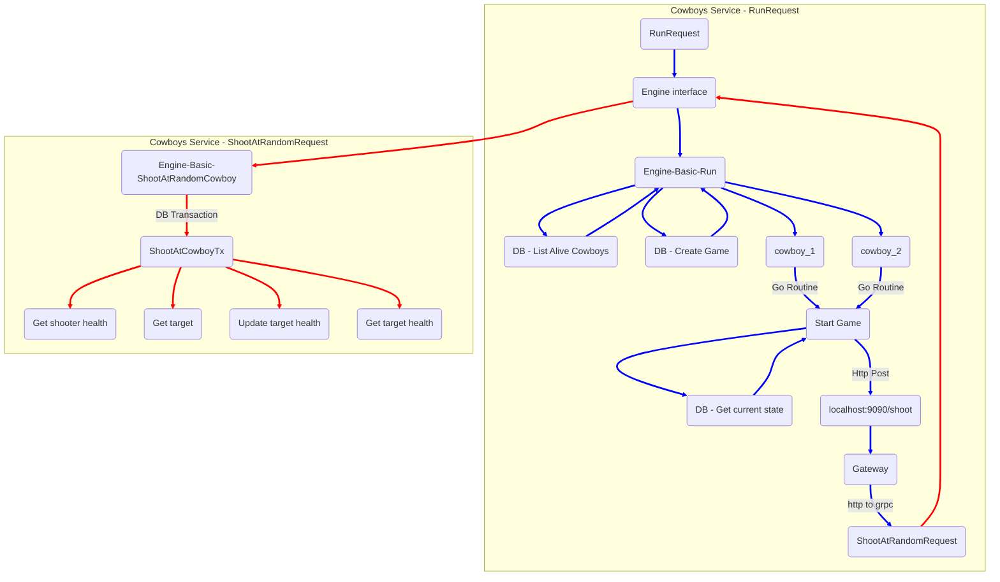

# Cowboys Service

## Summary

This service is a showcase of how a bunch of cowboys can shoot each other via Http or Grpc connection. \
This service is using CockroachDb as its persistent storage solution. \
This service has 2 modes of operation :
* **Basic** - Using Http for communication and fulfilling basic requirements
* **Intermediate** - Using Grpc for communication and storing action logs

<br/>

[[_TOC_]]

## Prerequisites
For your convenience this project is using taskfile so please follow the instructions and install it
```
https://taskfile.dev/installation/
```

## How to run and test it
This service can be run in 3 different ways
* **Locally**
* **Docker**
* **Deploy to k8s(minikube)**

Bellow are all the different ways to follow 

### 1. Locally( basic / intermediate )

Before you attempt to run this you will need to install cockroachDB or run a single node version in docker.\

-- Run the following command in your terminal
```
docker run -d \
--name=roach-single \
--hostname=roach-single \
--net=roachnet \
-p 26257:26257 \
-p 8080:8080 \
-v "roach-single:/cockroach/cockroach-data"  \
cockroachdb/cockroach:v23.1.12 start-single-node \
--http-addr=localhost:8080 --insecure 
```
Next -> Export `DB_URL` to your terminal
 ```
 export DB_URL=postgresql://root@{YOUR_DOCKER_IP}:26257/defaultdb?sslmode=disable
  
EXAMPLE -> export DB_URL=postgresql://root@192.168.1.236:26257/defaultdb?sslmode=disable
 ```

Because we want to run this in basic mode run the application as 
```
MODE=basic go run .
```
By default service runs in an intermediate mode
```
go run .
```
#### To test and see the console logs
Use Postman to make a Post request to `localhost:9090/run`
Or
```
curl --request POST 'localhost:9090/run'
```

To Reload and try again 
```
curl --request POST 'localhost:9090/reload'
```
In intermediate mode you will get game_id and can check the logs e.g
```
curl --request GET 'localhost:9090/logs/200d96aa-b7f2-4083-b422-7313ecebf0de?offset=0&limit=50&sort=asc'
```

<br>
<br>

### 2. docker( intermediate )

To run the whole stack in docker \
Make sure you don't have cockroachDB or Traefik already running. \
-- Run 
```
task compose
```
If everything Succeeded you should be able to go to your browser and visit 
```
traefik.localhost
```
And navigate to Http routes, which should show you that we have `Host(`cowboys.localhost`)` exposed.

to test the endpoints first curl the healthz as I have noticed Traefik sometimes lagging behind with load balancing and dns stuff
```
curl cowboys.localhost/healthz
```
If this return "ok"\
proceed with running the game
```
curl --request POST cowboys.localhost/run
```
To reload the game call
```
curl --request POST cowboys.localhost/reload
```

<br>
<br>

### 3. Deploy to k8s (minikube) intermediate

This service includes a charts directory with service deployment \
This Deployment was tested on minikube for local setup \
Main dependency our service has is the `CockroachDB` and this needs to be deployed first

To Deploy CockroachDB using helm run 
```
task deploy-crdb
```

Next to deploy our service run
```
task deploy-service
```

Note:
This should not be deployed to an actual cluster as the cockroachdb is running on a limited stoarge and tls configuration.

<br>

To test service running on k8s first port forward it
```
kubectl port-forward <your_pod_name> 8084:8080 -n dev
```
Open up logs in another terminal window
```
kubectl logs -n dev <your_pod_name> --follow
```

Then go to Postman open GRPC request and put `localhost:8084` and make grpc call to run the service


## Architecture

### Basic Http communication in Local run mode
Bellow is a flowchart showing what happens in the basic cowboy shooting process. 


